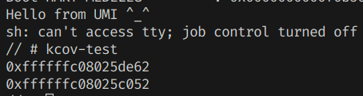

# kcov 相关支持

## 设计

按照Linux的标准实现，每个线程拥有一个私有的kcov信息结构体，包含一段跟用户交互的内存空间，和一些状态配置信息。

该kcov内存空间以地址大小为单元，在RISC-V64位平台则对应8个字节。第一个单元保存其后所有单元的个数，而其后的单元则依次保存跟踪到的函数返回地址。

    +-----------+
    | count (n) |
    +-----------+
    |  addr 1   |
    +-----------+
    |  addr 2   |
    +-----------+
    |  ...      |
    +-----------+
    |  addr n   |
    +-----------+

在内核中运行需要跟踪的函数时，Linux标准实现是增加了一个gcc插件，在每个要被跟踪的函数头插入添加跟踪记录的函数代码。在本次实现中进行实验性地手动添加记录函数的调用，执行效率与Linux相当。

## 实现

1. 将kcov信息结构体添加到线程结构体中，并做相应的初始化；
2. 在需要被跟踪记录的函数开头手动加入记录函数，在其中向当前线程的kcov信息结构体中添加并更新记录；
3. 在debugfs中向用户提供访问该kcov的内存空间的文件接口；
4. 在ioctl等系统调用中提供专门的对应处理，以便用户进行初始化支持。

## 测试

1. 将[Linux 内核网站的测试程序](https://www.kernel.org/doc/html/latest/dev-tools/kcov.html)编译成目标平台的Linux可执行文件，静态或动态链接均可；
2. 将该可执行文件与busybox等必要组件一起打包成SD卡镜像，以便OS启动时读取；
3. 在[`main.rs`](../mizu/kernel/src/main.rs)中将主函数的主要执行代码（`test_all`）替换成`self::test::busybox_interact().await`以在运行时进入busybox shell的交互界面，必要时在[`test.rs`](../mizu/kernel/src/test.rs)中修改busybox的路径以适配SD卡镜像；
4. 在[根目录的Makefile](../Makefile)中修改ROOTFS成打包好的SD卡镜像，以及QEMU相关参数，以便进入终端的交互界面；
5. 运行`make -s run`，在busybox中运行该可执行文件，并查看结果；可以在内核源码的任意异步函数中添加对应的调用（`crate::fs::coverage().await`）以便观察结果变化。

在目前测试中，在[内核源码中](../mizu/kernel/src/task/future.rs)的`handle_scause`和`handle_syscall`两个函数中添加了跟踪记录函数。输出如下所示：

检查编译生成的`debug/mizu.txt`和`debug/mizu.asm`，发现并找不到直接对应的函数。推断原因是异步函数的实际执行并不挂名异步函数本身，而是挂名返回的匿名`Future`对象。因此需要进一步收集元信息才能在未来的实现中将调用地址直接对应到函数名字。不过那将是`addr2line`程序的另一番工作了。